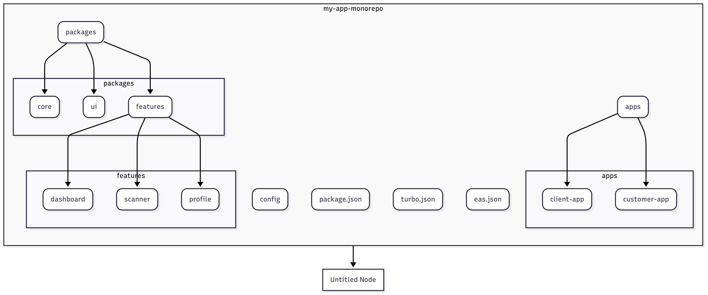

# Monorepo App  — Summary

**One codebase. Multiple branded apps. Clear ownership. Fast shipping.**

---

## Executive Summary

This monorepo leverages **Expo + Turborepo + EAS** to build multiple branded applications from a single codebase. Shared packages contain UI components, core logic, and feature modules, while client-specific configurations are injected at build time. The result is minimal code duplication with controlled feature flags and branding per client.

---

## Architecture Overview

### Core Components
- **Shared Packages**: UI components, core logic, and feature modules used across all apps
- **Client Configs**: JSON files that override branding and feature flags per client
- **Build Profiles**: EAS configuration that selects which client config to include
- **Runtime Merge**: Core package automatically merges base + client-specific settings

### Folder Structure
```
my-app-monorepo/
├── apps/
│   ├── client-app/         # Client-specific app entry
│   └── customer-app/       # Customer-facing entry
├── packages/
│   ├── ui/                 # Shared UI components
│   ├── core/               # Config, auth, api client
│   └── features/           # Feature modules (scanner, dashboard, profile)
├── config/                 # Base + client overrides
│   ├── base.json
│   └── dlf.json
├── eas.json                # EAS build profiles
└── turbo.json              # Turborepo pipeline
```

### Visual Architecture Diagram



---

## How It Works

1. **Build Time**: EAS build profile selects client configuration
2. **Runtime**: Core package merges base config with client-specific overrides
3. **App Behavior**: Same codebase adapts branding and features automatically
4. **Deployment**: CI/CD uses Turborepo for fast, cached builds to separate channels

---

## Client Configuration Example

```json
{
  "client": { 
    "id": "dlf", 
    "name": "DLF" 
  },
  "branding": { 
    "primaryColor": "#1E40AF", 
    "logo": "./assets/dlf-logo.png" 
  },
  "features": { 
    "scanner": { "enabled": true } 
  }
}
```

---

## Advantages

✅ **Single source of truth** - Reduces bugs and duplicate fixes  
✅ **Faster releases** - Shared package changes propagate to all apps  
✅ **Consistent UX** - Shared UI ensures design consistency  
✅ **Config-driven branding** - New clients added via config + build profile  
✅ **Feature gating** - Quick enable/disable per client  
✅ **Lower maintenance** - Less duplicated code to maintain  

---

## Scalability Considerations

| Scale | Management | Requirements |
|-------|------------|--------------|
| **Small (1-10 clients)** | Easy to manage, quick onboarding | Basic conventions |
| **Medium (10-50 clients)** | Config validation, clear ownership | Targeted CI testing |
| **Enterprise (50+ clients)** | Config management system | Versioning strategy, minimal native code |

---

## Challenges & Solutions

| Challenge | Solution |
|-----------|----------|
| **Higher initial effort** | Use templates and clear conventions |
| **Branching complexity** | Trunk-based development + feature flags |
| **Config drift risk** | Schema validation and CI checks |
| **Native customizations** | Keep logic in JS/TS, isolate native code |
| **Onboarding overhead** | Documentation, starter scripts, mentorship |

---

## Key Takeaways

- **One codebase builds multiple branded apps**
- **Config-driven system maintains consistency while enabling flexibility**
- **Scales effectively with proper tooling and conventions**
- **Challenges are manageable with validation, CI, and clear processes**

---

## Technology Stack

- **Framework**: Expo (React Native)
- **Build System**: Turborepo
- **Deployment**: EAS (Expo Application Services)
- **Language**: TypeScript
- **Architecture**: Monorepo with shared packages
